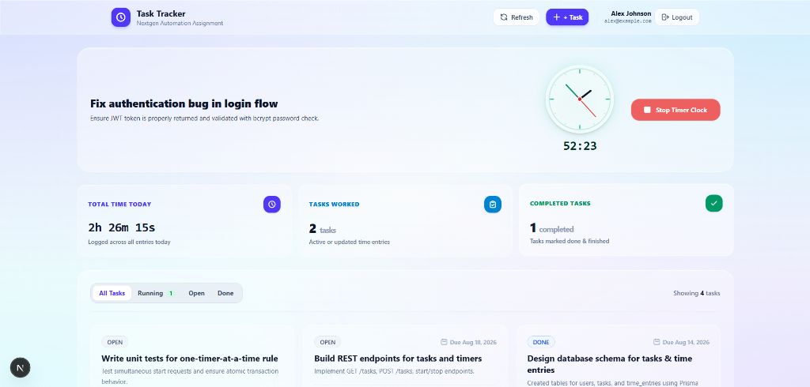

# Task Tracker Client Application

Hi! I'm Om Maheshwari, a Full Stack Developer specializing in building modern applications with Next.js, React, Node.js, Express, MongoDB and PostgreSQL. I craft efficient, scalable solutions that bridge ideas and reality.

Beyond web development, I'm deeply immersed in mastering Data Structures & Algorithms to build a rock-solid foundation in optimized problem-solving. This dual focus helps me write cleaner code and design performance-critical systems.

🌐 **Live Client App (Vercel)**: [https://task-tracker-client-xi.vercel.app](https://task-tracker-client-xi.vercel.app)  
🌐 **Live Server API (Render)**: [https://task-tracker-backend-377j.onrender.com](https://task-tracker-backend-377j.onrender.com)  
🔗 **Portfolio**: [https://om-portfolio-green-sigma.vercel.app](https://om-portfolio-green-sigma.vercel.app)  
🔗 **Frontend Repository**: [https://github.com/OmMaheshwari653/taskTrackerClient.git](https://github.com/OmMaheshwari653/taskTrackerClient.git)  
🔗 **Backend Repository**: [https://github.com/OmMaheshwari653/task-tracker-backend.git](https://github.com/OmMaheshwari653/task-tracker-backend.git)

---

## 📸 Dashboard Preview



---

## 📂 Client Project Directory Architecture

```
client/
├── public/              # Static assets (favicons, dashboard-preview.png, fonts)
├── src/
│   ├── app/             # Next.js App Router pages, layout, and global CSS
│   │   ├── favicon.ico
│   │   ├── globals.css  # Soft Light Glassmorphism design system & keyframe animations
│   │   ├── layout.tsx   # Root layout with AuthProvider & global background canvas
│   │   └── page.tsx     # Main Task Tracker dashboard & authentication view router
│   ├── components/      # Modular, reusable React UI components
│   │   ├── auth/        # LoginForm & RegisterForm components with Quick Seed pills
│   │   ├── layout/      # Header frosted glass top navigation bar
│   │   ├── tasks/       # TaskList, TaskCard, TodaySummary, RunningTimerBar, Modals
│   │   └── ui/          # GlassClockWidget (SVG animated clock with rotating hands)
│   ├── context/         # AuthContext provider for global JWT session management
│   ├── hooks/           # useLiveTimer custom hook for background-accurate elapsed time
│   └── lib/             # Typed API client, formatters, & constants
│       ├── api.ts       # Typed API client interfacing with Express backend
│       ├── constants.ts # Storage keys & default API URLs
│       └── formatters.ts# Time duration & date formatting helper functions
├── .env.example         # Template for client environment variables
├── Dockerfile           # Standalone Docker build file for Next.js client
├── package.json         # Client dependencies & scripts
└── tsconfig.json        # TypeScript compiler configuration
```

---

## 🎨 Design System & Framework Choice
- **Framework**: **Next.js (App Router v16)**. Approved as a web client alternative to React Native CLI.
- **Styling & Aesthetics**: Custom **Soft Light Glassmorphism UI** using Vanilla CSS utilities (`globals.css`) + Tailwind CSS v4. Features translucent frosted glass panels (`backdrop-blur-md`), ambient colorful mesh canvas background, animated SVG analog clock widget with rotating hands, and responsive layouts.
- **Timer Accuracy**: Custom `useLiveTimer` hook calculates elapsed time dynamically from `Date.now() - new Date(startTime).getTime()`, with automatic `visibilitychange` focus re-syncing so the timer remains 100% accurate when backgrounded and reopened.
- **Optimistic UI Updates**: 0ms UI latency when starting/stopping timers or creating tasks.

---

## 📱 2. How to Run Mobile/Client App from a Clean Machine

### Step A: Clone Repository & Change Directory
```bash
# 1. Clone client repository from GitHub
git clone https://github.com/OmMaheshwari653/taskTrackerClient.git

# 2. Change directory into client project
cd taskTrackerClient
```

### Step B: Environment Variable Configuration
Create a `.env.local` file in the `client` directory (refer to `.env.example`):
```env
NEXT_PUBLIC_API_URL=http://localhost:8080
```
> **Where to change the API base URL**: Modify `NEXT_PUBLIC_API_URL` in `client/.env.local` to point to your deployed or local backend server URL.

### Step C: Install Dependencies & Run Client App
```bash
# 1. Install dependencies
npm install

# 2. Start Next.js Development Server
npm run dev
```
Open **`http://localhost:3000`** in your browser.

---

## 🐳 Docker Instructions for Client Repository

If you clone only this client repository (`taskTrackerClient`), you can run it with Docker using Dockerfile:

```bash
# 1. Build Client Docker Image
docker build -t task-tracker-client .

# 2. Run Client Container (connected to running backend on localhost:8080)
docker run -p 3000:3000 -e NEXT_PUBLIC_API_URL="http://localhost:8080" task-tracker-client
```
The client app will be accessible at `http://localhost:3000`.

---

## 💡 Why Redux Was NOT Used
- **No Unnecessary Overhead**: Redux adds heavy boilerplate, serializable state restrictions, and store subscription latency for simple CRUD/timer states.
- **Native Efficiency**: Native React `useState`, `useContext` (`AuthContext`), custom hooks (`useLiveTimer`), and typed API client (`src/lib/api.ts`) provide 0ms latency, zero boilerplate overhead, and direct Optimistic UI updates.

---

## 🔑 3. Login Details for Test Users
Password for all test users: **`password123`**

- `alex@example.com`
- `sarah@example.com`
- `dev@example.com`

---

## ⏳ 6. Time Spent
- Roughly **8 hours** total across full-stack development, UI polish, testing, and documentation.
